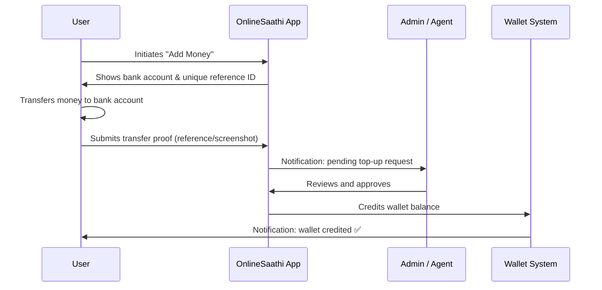

# Add Money to Your Wallet

The OnlineSaathi wallet lets you store balance and use it across all connected applications. You can top up your wallet via bank transfer.

---

## How it Works



---

## User Guide (Step by Step)

### Step 1 — Go to Wallet
Navigate to **My Wallet** from the sidebar or home screen.

### Step 2 — Click "Add Money"
Click the **Add Money** or **Top Up** button on your wallet page.

### Step 3 — Select Amount
Enter the amount you want to add (minimum: **NPR 100**, maximum: **NPR 100,000** per transaction).

### Step 4 — Make the Bank Transfer
Transfer the exact amount to the OnlineSaathi bank account:

| Detail | Value |
|--------|-------|
| **Bank** | Nepal Investment Mega Bank |
| **Account Name** | OnlineSaathi Pvt. Ltd. |
| **Account Number** | `1234567890` |
| **Note / Remarks** | Your **Reference ID** (e.g., `ONS-12345`) |

> ⚠️ **Important:** Always include your **Reference ID** in the bank transfer remarks. This is how we identify your payment.

### Step 5 — Submit Proof
After transferring, come back to the app and:
- Enter the **bank transaction reference number** (voucher number)
- Upload a **screenshot** of the transfer receipt (optional but recommended)
- Click **Submit**

### Step 6 — Wait for Approval
Our team will verify your transfer within **1–24 hours** (business days).  
You'll receive a notification once your wallet is credited.

---

## Wallet Balance Details

| Field | Description |
|-------|-------------|
| **Balance** | Current available balance in NPR |
| **Pending** | Amount awaiting admin verification |
| **Transaction History** | All past top-ups, debits, and transfers |

---

## API Reference

### Get Wallet
```http
GET /api/wallet
Authorization: Bearer <token>
```
**Response:**
```json
{
  "success": true,
  "data": {
    "balance": 5000,
    "currency": "NPR",
    "pendingTopup": 1000
  }
}
```

---

### Get Transaction History
```http
GET /api/wallet/transactions
Authorization: Bearer <token>
```
**Response:**
```json
{
  "success": true,
  "data": [
    {
      "_id": "txn_001",
      "type": "topup",
      "amount": 1000,
      "status": "completed",
      "method": "bank_transfer",
      "referenceId": "ONS-12345",
      "createdAt": "2026-03-13T06:00:00.000Z"
    }
  ]
}
```

---

### Submit Top-Up Request
```http
POST /api/wallet/topup
Authorization: Bearer <token>
Content-Type: application/json
```
**Body:**
```json
{
  "amount": 1000,
  "method": "bank_transfer",
  "referenceId": "ONS-ABC-2026",
  "bankVoucherNumber": "NIMB-TXN-9876543",
  "screenshotUrl": "https://cdn.example.com/receipt.jpg"
}
```

| Field | Type | Required | Description |
|-------|------|----------|-------------|
| `amount` | `number` | ✅ | Amount in NPR |
| `method` | `string` | ✅ | Payment method (`bank_transfer`, `esewa`, `khalti`) |
| `referenceId` | `string` | ✅ | Your unique reference ID shown in the app |
| `bankVoucherNumber` | `string` | ✅ | Bank transaction/voucher number |
| `screenshotUrl` | `string` | ❌ | URL of the uploaded receipt screenshot |

**Success Response:** `200 OK`
```json
{
  "success": true,
  "message": "Top-up request submitted. Pending admin verification.",
  "data": {
    "transactionId": "txn_abc123",
    "status": "pending",
    "amount": 1000
  }
}
```

**Error Responses:**

| Status | Reason |
|--------|--------|
| `400` | Invalid amount or missing required fields |
| `401` | Unauthorized — invalid or missing token |
| `409` | Duplicate reference ID |

---

## Transaction Statuses

| Status | Meaning |
|--------|---------|
| `pending` | Submitted, awaiting admin review |
| `approved` | Verified — balance credited to wallet |
| `rejected` | Transfer could not be verified |

---

## Limits & Policies

| Policy | Value |
|--------|-------|
| Minimum top-up | NPR 100 |
| Maximum per transaction | NPR 100,000 |
| Daily limit | NPR 200,000 |
| Processing time | 1–24 hours |
| Refund policy | Contact support within 7 days |

---

## Frequently Asked Questions

**Q: How long does it take for my balance to reflect?**  
A: Typically within 1–24 hours on business days. Submissions made on weekends or holidays may take longer.

**Q: I forgot to add my reference ID in the bank remarks. What should I do?**  
A: Contact support immediately with your bank receipt. Our team will manually verify and credit your wallet.

**Q: My top-up was rejected. What now?**  
A: Check the rejection reason in your transaction history. Common reasons include mismatched amounts or missing / wrong reference IDs. Resubmit or contact support.

**Q: Can I use eSewa or Khalti?**  
A: Digital payment gateway integration (eSewa, Khalti) is coming soon. Currently, only bank transfer is supported.

---

## Need Help?

Contact our support team at **support@onlinesaathi.com** or visit the [Getting Started](./getting-started) page.
